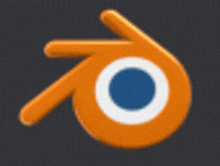
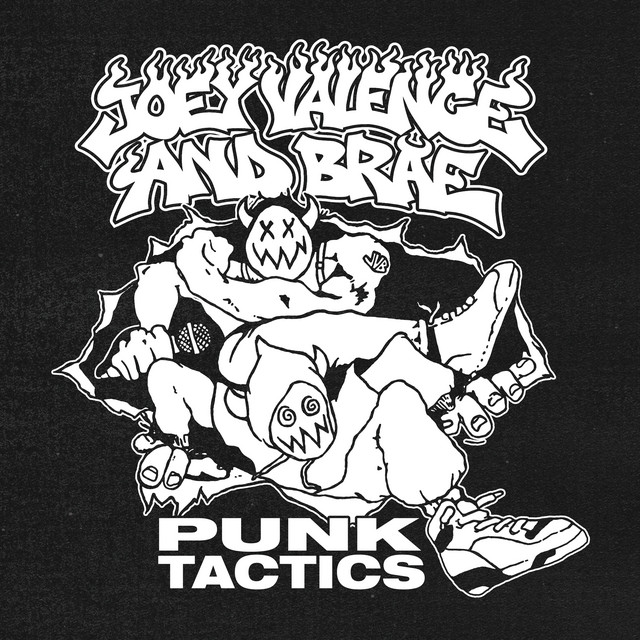

<!-- README.md is generated from README.Rmd. Please edit that file -->

<table style="width:100%; border-spacing: 10px;">
    <tr>
        <td style="width:30%;">
            
        </td>
        <td style="width:70%;">
            
Hi, my name is Saul, I'm from Bolivia

            
and I'm into computer stuff I guess

            <ul>
                <li>How to reach me:</li>
                <ul>
                    <li>Email: <a href="mailto:baulchoc@gmail.com">baulchoc@gmail.com</a></li>
                    <li>Website: <a href="http://baluchop.sendbol.lat/">Baluchop</a></li>
                </ul>
            </ul>
        </td>
    </tr>
</table>

<h2>About Me</h2>

Currently, I'm studying a Software Development degree at UMSA.

I’m volunteering at <a href="https://asoblockchainbolivia.org/">AsoblockchainBolivia</a> where I particularly focus on Web 3 solutions and maintenance of Web 2 projects.

I’m making an internship as a software developer at <a href="https://blockchainconsultora.com/es">BlockchainConsultora</a> mostly doing web 3 stuff too.

Aaaalso, I have a YouTube channel (which I don't use {I'll upload something eventually just wait}).

 

<!-- README.md is generated from README.Rmd. Please edit that file -->

## Skills

<table border="1px solid black" style="margin: 5px">

<td>

      

   

     

</td>

</table>

## Music that I like 🎵🎶

## My down time

 

<!--
**SaulChoque/SaulChoque** is a ✨ _special_ ✨ repository because its `README.md` (this file) appears on your GitHub profile.

Here are some ideas to get you started:

- 🔭 I’m currently working on ...
- 🌱 I’m currently learning ...
- 👯 I’m looking to collaborate on ...
- 🤔 I’m looking for help with ...
- 💬 Ask me about ...
- 📫 How to reach me: ...
- 😄 Pronouns: ...
- ⚡ Fun fact: ...
-->
